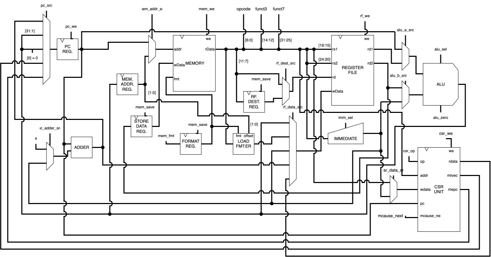

# RISC-V processor

Written in Veryl, this processor is a mostly single-cycle RV32I_Zicsr processor with unified memory and efficient component usage.

CSRs include:
* mepc
* mcause
* mtvec

All instructions complete in 1 cycle except Load and Store instructions, which take 2 cycles. This is due to the use of unified memory.

## Diagram

## Instructions
Install the Veryl toolchain, accessible at https://veryl-lang.org/install/

1. Build: `veryl build`
2. Make: `make` (assembles program)
3. Test: `veryl test`

Program.S is a small program that checks CSR instructions.
This is a preliminary test; more comprehensive tests will be added in the future.
